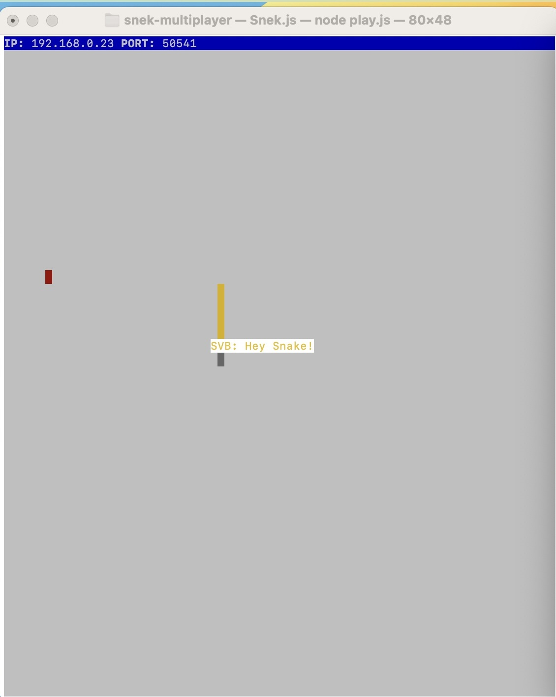
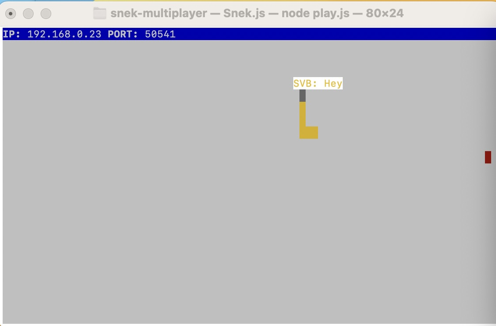

# Snake Client Project

Snake game is a very popular video game. It is a video game concept where the player maneuvers a dot and grows it by ‘eating’ pieces of food. As it moves and eats, it grows and the growing snake becomes an obstacle to smooth maneuvers. The goal is to grow it to become as big as possible without bumping into the side walls, or bumping into itself, upon which it dies.

This is simply a multiplayer take on the genre.

Before you can run this client, you will need to be running the server side which you can download and install from here. 

## Final Product

## Getting Started

- To run the snake client, one first need to set up and run the server side of the project as mentioned below:
1. Clone serverside code from https://github.com/lighthouse-labs/snek-multiplayer.git
2. Open a terminal/command prompt and navigate to the snek-multiplayer directory.
3. Install the necessary dependencies by running the following commands:
    npm install
    npm run play

- Run the development snake client using the `node play.js` command.